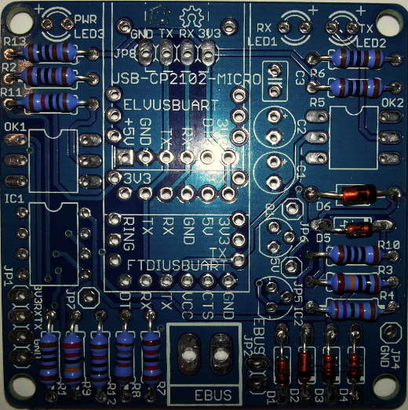

# Basisplatine

## Allgemeiner Aufbau der Basisplatine

Die Basisplatine dient als Grundlage und stellt den eigentlichen Konverter dar.
Alleine mit ihr ist die Kommunikation via UART an einen Raspberry oder mittels Wlan direkt an den eBus Dämon möglich.

Die Basisplatine beinhaltet den Komparator zur Detektierung der RxD Signale, die Optokoppler zur galvanischen Trennung
und den Sendeteil an den eBus.

Sie kann bis zu 3 verschiedene Uarts zur seriellen Kommunikation aufnehmen oder über eine Stiftleiste mit einem Wemos D1
verbunden werden. 

Die Stromversorgung der Platine erfolgt direkt aus dem Netz des eBus. Die Gesamtstromaufnahme sollte laut eBus
Spezifikation jedoch nicht mehr als 18 mA betragen. Sie besitzt eine galvanische Trennung zwischen eBus und dem
Kommunikationsteil zum Dämon.
Die Stromversorgung des Uart oder des Wemos erfolgt über ein handelsübliches USB-Stecker Netzteil mit ausreichender
Leistung (1A-2A).

## Bestückung der Basisplatine

  
**Bestückung**

Die Platinen sind nicht bleifrei gefertigt (HASL), daher kann mit normalem bleihaltigem Lötzinn gelötet werden.
Der Gesetzgeber lässt dies im privaten und teilweise im kommerziellen Bereich noch zu.

Die Bestückung der Basisplatine erfolgt nach den üblichen Regeln, d.h. die niederen Bauteile zuerst, dann schichtweise
die nächst höheren.

Mit den Widerständen beginnen, dann die Dioden, ICs, Kondensatoren, Buchsenleisten, Transsistoren, Printklemme usw.

Beim Einlöten der Widerstände sollte man unbedingt vor dem Einlöten den Widerstandswert mit einem Ohm-Meter kontrollieren,
um Verwechslungen zu vermeiden.

  
**Fertig aufgebaute Basisplatine**

Die Buchsenleisten für nicht vorhandene Uarts kann man sich in der Regel sparen und müssen nicht bestückt werden. 

Bei den Optokopplern ist unbedingt zu achten das diese richtig eingesetzt werden.
Es befindet sich links unten jeweils ein Punkt, das ist Pin 1 und ist so zu platzieren das dieser beim Aufdruck der
Aussparung ist. Gleiches gilt für den Komparator.

## UARTS auf der Basisplatine

## Wemos D1 auf der Basisplatine
